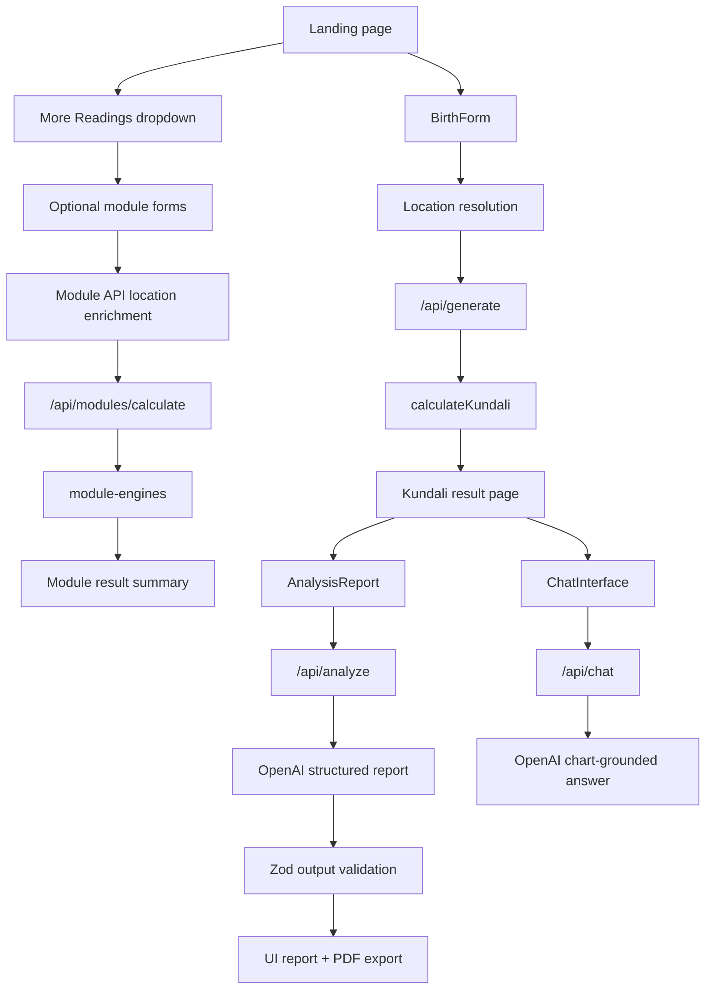

# Architecture

This document describes Vedic Astra as a harness-engineering-oriented product: deterministic calculations, validated model outputs, explicit capability boundaries, and repeatable evaluation gates.

## System Goals

Vedic Astra should provide useful Vedic astrology insights while preserving user trust.

The architecture is designed around four boundaries:

1. **Input boundary** - Validate and normalize user-provided birth/event details.
2. **Calculation boundary** - Produce deterministic chart/module data with transparent limitations.
3. **Generation boundary** - Use AI only for interpretation and language, not unsupported calculations.
4. **Presentation boundary** - Show layperson-friendly outputs while keeping technical details available but not intrusive.

## High-Level Flow

## Runtime Components

### Frontend

| Component | Responsibility |
| --- | --- |
| `app/page.tsx` | Landing shell and primary flow container. |
| `components/BirthForm.tsx` | Birth input form, city/country collection, location confirmation, and local storage handoff. |
| `components/OptionalModulesTabs.tsx` | Compact flow selector plus standalone optional module input/result UX. |
| `app/kundali/page.tsx` | Main generated chart page, chart style switcher, current transit context, analysis report, and chat. |
| `components/SouthIndianChart.tsx` | Visual chart rendering for North, South, and East Indian layouts. |
| `components/AnalysisReport.tsx` | Full report generation UI, section reveal behavior, TTS controls, and PDF export. |
| `components/ChatInterface.tsx` | Floating chart-grounded chat UI. |

### API Routes

| Route | Responsibility | Validation |
| --- | --- | --- |
| `POST /api/generate` | Generates core Kundali data from normalized birth details. | Zod birth schema: date, time, lat/lon, timezone, IANA zone. |
| `POST /api/modules/calculate` | Runs deterministic optional module screens. | Zod module type, required fields, date/time formats, location enrichment. |
| `POST /api/analyze` | Produces structured full report through OpenAI. | Preference schema, optional input schema, LLM JSON schema. |
| `POST /api/chat` | Produces concise chart-grounded answers. | Request presence checks, rate limiting, message length caps. |
| `POST /api/timezone` | Resolves timezone offset for user-selected location/date/time. | Endpoint-specific input validation should remain strict when extended. |

### Core Libraries

| Library File | Responsibility |
| --- | --- |
| `lib/astrology/calculator.ts` | Core planetary, house, dasha, varga, age, life-stage, and transit calculation. |
| `lib/astrology/module-engines.ts` | Standalone deterministic screens for optional modules. |
| `lib/astrology/types.ts` | Shared contracts for chart, planet, dasha, transit, and metadata data. |
| `lib/astrology/utils.ts` | Zodiac, nakshatra, dignity, and helper logic. |
| `lib/analysis-options.ts` | Registry for chart layouts, reading systems, and optional feature labels/descriptions. |

## Data Contracts

### BirthDetails

`BirthDetails` is the normalized input consumed by the calculation engine.

Required:

- `dateString` in `YYYY-MM-DD`
- `timeString` in `HH:mm`
- `lat`
- `lon`
- `timezone`

Optional:

- `name`
- `city`
- `country`
- `timeZoneId`

User-facing forms should only ask for city and country. Coordinates and timezone are implementation details.

### KundaliResult

The core chart contract includes:

- Birth details
- Ayanamsa
- Planet positions
- Whole-sign houses
- Ascendant
- D1 and D9 vargas
- Vimshottari Dasha
- Age and life stage
- Current transit context
- Calculation metadata and accuracy notes

This is the canonical object for chart display, report generation, and chat grounding.

### ModuleCalculationResult

Optional modules return:

- `module`
- `title`
- `summary`
- `score` and/or `scores`
- `insights`
- `calculationDetails`
- `limitations`
- `nextSteps`
- `generatedAt`

The UI should translate technical details into plain language. Detailed calculation scope belongs in docs, not primary result cards.

## Calculation Boundary

Current deterministic support:

- Approximate Lahiri ayanamsa
- Whole-sign houses
- Mean lunar nodes
- Planetary positions through `astronomy-engine`
- D1 and D9 chart support
- Vimshottari Dasha
- Current transit snapshot
- Optional module screens for matching, Panchang/Muhurat, Dosha, Varga, Yoga, and Strength

Important limitations:

- The system does not yet have professional-grade golden-test validation against a trusted ephemeris suite.
- KP cusps/sub-lords are not fully implemented.
- Full Shadbala and BAV/SAV Ashtakavarga bindu tables are not fully implemented.
- Panchang/Muhurat is a date-window screen, not a full electional astrology engine.
- Yoga and Dosha modules are rule-based screens, not exhaustive tradition-specific judgement.

## AI Generation Boundary

AI should:

- Explain deterministic chart and module outputs.
- Produce readable, structured reports.
- Convert chart factors into practical, non-fatalistic insights.
- Respect age and life-stage constraints.
- State limitations when data is absent.

AI must not:

- Invent missing calculations.
- Assert unprovided past events as facts.
- Claim professional certainty.
- Diagnose medical, legal, financial, or mental health outcomes.
- Follow prompt-injection instructions embedded in user free text.

Current model configuration:

- `/api/analyze`: `gpt-4o-mini`
- `/api/chat`: `gpt-4o-mini`

## Prompting and Schema Strategy

The report endpoint uses:

- A system prompt built from chart age, life stage, preferences, and optional module context.
- A strict JSON contract.
- Zod validation on returned JSON.

The preferred pattern is:

1. Generate deterministic context.
2. Pass only needed context to the model.
3. Instruct the model to separate `Chart basis` from `Usable insight`.
4. Validate the model output before rendering.
5. Render unsupported or invalid output as an error, not a partial hallucinated report.

## State Management

The app currently uses local storage for:

- `birthDetails`
- `analysisPreferences`
- `optionalModuleInputs`
- `optionalModuleResults`

This is acceptable for local-first and no-account flows. If user accounts are added, move this state behind authenticated persistence with explicit data retention and deletion controls.

## Rate Limiting and Cost Controls

Current controls:

- In-memory per-IP rate limiting in analyze and chat routes.
- Chat session message cap.
- Chat message length cap.
- Last-message slicing for model context.

Production hardening should move rate limits to durable infrastructure such as Redis, Vercel KV, or another shared store.

## Observability Gaps

Recommended additions:

- Request IDs for API routes.
- Structured logs for validation failures, model failures, and calculation errors.
- Eval run IDs attached to generated reports during test mode.
- Latency and token-use metrics for OpenAI calls.
- Error budget for invalid model JSON.
- Snapshot of prompt version and calculation version in generated reports.

## Security and Privacy

Current data sensitivity:

- Birth details are personal data.
- Chart output can imply sensitive life areas.
- Chat and analysis requests send chart data to OpenAI when enabled.

Expected production controls:

- Clear privacy disclosure.
- No secret exposure in client bundles.
- Server-side OpenAI key only.
- Avoid logging raw birth data in production logs.
- Add retention policy before account persistence.
- Consider user deletion/export flows before saved charts.

## Extension Points

### Adding a New Calculation Engine

1. Define or extend types in `lib/astrology/types.ts`.
2. Implement deterministic logic in `lib/astrology`.
3. Add validation in the relevant API route.
4. Add golden test cases and eval fixtures.
5. Update `ARCHITECTURE.md`, `EVALS.md`, and README if user-facing.
6. Make the UI expose limitations honestly.

### Adding a New AI Report Section

1. Extend the Zod output schema.
2. Update the system prompt JSON contract.
3. Update `AnalysisReport.tsx` rendering and PDF export.
4. Add eval assertions for key presence, grounding, and safety.

### Adding Saved Accounts

Introduce an authenticated persistence layer. Do not keep expanding local storage into a pseudo-account system.

Minimum expected architecture:

- Auth provider
- Server-side chart ownership
- Encrypted or access-controlled storage
- User deletion/export
- Audit and retention policy

## Release Gates

Before shipping changes:

- `npm run lint` passes.
- `npm run build` passes.
- Browser smoke test for landing, birth chart flow, optional module flow, report generation entry, and chat entry.
- Mobile smoke test for the landing reading selector, birth form, optional module selector, chart-style selector, and chat window.
- Relevant eval fixtures pass manually or through a harness.
- No new unsupported claims in prompts or visible copy.

For high-risk changes:

- Add golden calculation cases.
- Run regression evals.
- Include before/after screenshots for UI.
- Document known limitations in the PR.
