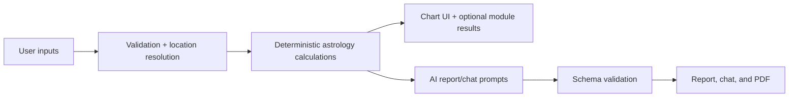

# Vedic Astra

Vedic Astra is a Next.js Vedic astrology product that combines deterministic chart calculations with AI-assisted interpretation. The product is designed around a harness-engineering mindset: validate inputs, calculate what can be calculated, constrain model output, document capability boundaries, and evaluate regressions before shipping.

## What The App Does

- Generates Vedic birth charts from date, time, city, and country.
- Resolves latitude, longitude, and timezone behind the scenes.
- Renders North Indian, South Indian, and East Indian chart layouts.
- Produces a structured full analysis report with chart-basis and practical insight separation.
- Supports chart-grounded chat.
- Provides standalone optional flows:
  - Kundli Matching (Milan)
  - Panchang & Muhurat
  - Dosha Analysis
  - More Varga Charts
  - Yoga Detection
  - Shadbala / Ashtakavarga strength screen
- Exports generated analysis as a structured PDF.

## Product Principles

1. **Be useful without pretending certainty.**
   Astrology output should be practical and understandable, but never deterministic or fear-based.

2. **Do not overclaim missing engines.**
   If the app does not have full KP, Shadbala, Ashtakavarga, Panchang, or Muhurat calculations, the AI layer must not claim those results.

3. **Keep the UI layperson-friendly.**
   Users should not need to understand latitude, longitude, timezone, house-system metadata, or internal calculation scope to use the app.

4. **Separate calculation from interpretation.**
   Deterministic calculations live in `lib/astrology`. AI endpoints explain and structure insights from available data.

5. **Evaluate high-risk behavior.**
   Age fit, past-event hallucination, unsupported precision, and safety boundaries are first-class eval concerns.

## Tech Stack

- **Framework:** Next.js 16 App Router
- **Language:** TypeScript
- **UI:** React 19, Tailwind CSS v4, Lucide React
- **Astrology:** `astronomy-engine`, custom Vedic calculation layer
- **Timezone:** `tz-lookup`, server-side timezone endpoint
- **AI:** OpenAI API, default model `gpt-4o-mini`
- **Validation:** Zod

## Repository Guide

| Path | Purpose |
| --- | --- |
| `CLAUDE.md` | AI-agent operating guide and repo-level engineering rules. |
| `ARCHITECTURE.md` | System architecture, data flow, boundaries, and extension points. |
| `EVALS.md` | Evaluation strategy, rubrics, and release gates. |
| `evals/` | Eval cases and harness scaffolding. |
| `app/page.tsx` | Landing page and flow entry. |
| `app/kundali/page.tsx` | Main chart and report page. |
| `app/api/generate/route.ts` | Chart generation API. |
| `app/api/analyze/route.ts` | Structured AI report API. |
| `app/api/chat/route.ts` | Chart-grounded chat API. |
| `app/api/modules/calculate/route.ts` | Optional module calculation API. |
| `components/BirthForm.tsx` | Birth detail form and location confirmation. |
| `components/OptionalModulesTabs.tsx` | Birth chart selector and standalone optional module flows. |
| `components/AnalysisReport.tsx` | Full report UI, TTS, and PDF export. |
| `components/ChatInterface.tsx` | Floating chart-grounded assistant. |
| `components/SouthIndianChart.tsx` | Chart visualization component. |
| `lib/astrology/` | Deterministic astrology calculation logic. |
| `lib/analysis-options.ts` | Analysis-system, chart-style, and optional-feature registry. |

## Getting Started

### 1. Install dependencies

```bash
npm install
```

### 2. Configure environment

Create `.env.local`:

```env
OPENAI_API_KEY=your_openai_api_key_here
```

The app can build without the key, but AI report and chat calls require it at runtime.

### 3. Run the dev server

```bash
npm run dev
```

Open `http://localhost:3000`.

### 4. Validate locally

```bash
npm run lint
npm run build
```

Note: in sandboxed environments, `next build` may require permission to spawn a local process during Turbopack CSS processing.

## Architecture Summary



The full architecture is documented in `ARCHITECTURE.md`.

## AI and Prompting Contract

The model is used for language and interpretation, not as a hidden calculation engine.

Current default model:

- Full analysis: `gpt-4o-mini`
- Chat assistant: `gpt-4o-mini`

Expected behavior:

- Use provided chart data.
- Separate `Chart basis:` from `Usable insight:`.
- Respect age and life-stage context.
- State limitations when requested calculations are absent.
- Avoid factual claims about unprovided past events.
- Avoid deterministic medical, legal, financial, or relationship advice.

The full AI-agent and output contract is documented in `CLAUDE.md`.

## Evaluation Strategy

The eval strategy is documented in:

- `EVALS.md`
- `evals/README.md`
- `evals/cases/*.json`
- `evals/rubrics/*.md`

Current eval focus:

- Schema validity.
- Grounding to chart data.
- Age-appropriate interpretation.
- No unsupported precision.
- No hallucinated past events.
- Safety and high-stakes boundaries.
- Optional module independence.
- Mobile and UI clarity.
- PDF readability.

Recommended future commands once a runner is added:

```bash
npm run evals
npm run evals:golden
npm run evals:llm
npm run evals:ui
```

## Current Capability Boundaries

Implemented:

- Approximate Lahiri ayanamsa
- Whole-sign houses
- Mean lunar node
- Planet positions through `astronomy-engine`
- D1 and D9 chart support
- Vimshottari Dasha
- Current transit snapshot
- Standalone optional module screens
- Structured AI report generation
- Chart-grounded chat

Known boundaries:

- Full KP sub-lord/cusp calculations are not implemented.
- Full Shadbala and BAV/SAV Ashtakavarga tables are not implemented.
- Panchang/Muhurat is currently a date-window suitability screen, not a full electional engine.
- Yoga and Dosha modules are rule-based screens, not exhaustive tradition-specific judgement.
- Professional-grade golden-test validation against trusted ephemeris sources still needs to be added.

## Development Standards

Before merging substantial changes:

```bash
npm run lint
npm run build
```

For UI changes:

- Check desktop and mobile layout.
- Verify no horizontal overflow.
- Verify inline validation.
- Verify optional modules remain discoverable but not visually dominant.
- Use mobile-native controls for mobile navigation. Do not force desktop popovers or segmented pills into narrow screens.

For prompt or report changes:

- Review `EVALS.md`.
- Add or update eval fixtures.
- Confirm no unsupported calculations are claimed.
- Confirm past timeline entries are verification windows.

For calculation changes:

- Add golden cases.
- Document source of truth and tolerances.
- Update `ARCHITECTURE.md` if data contracts change.

## Privacy and Safety

Birth details are sensitive personal data. Current local-first behavior uses browser local storage for chart inputs and module results. Before adding user accounts or saved charts, the product needs:

- Authenticated persistence.
- Data retention and deletion controls.
- Clear user data export/deletion policy.
- Production-safe logging that avoids raw birth data.

Vedic Astra is for reflection and planning. It must not present itself as medical, legal, financial, mental-health, or crisis guidance.
